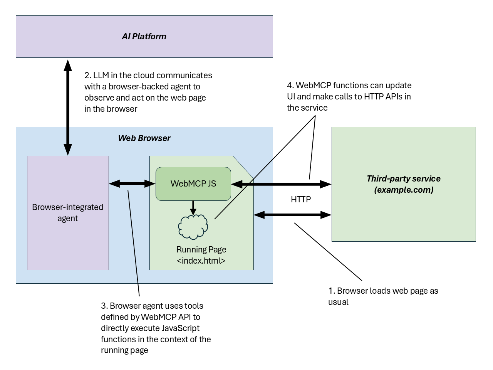
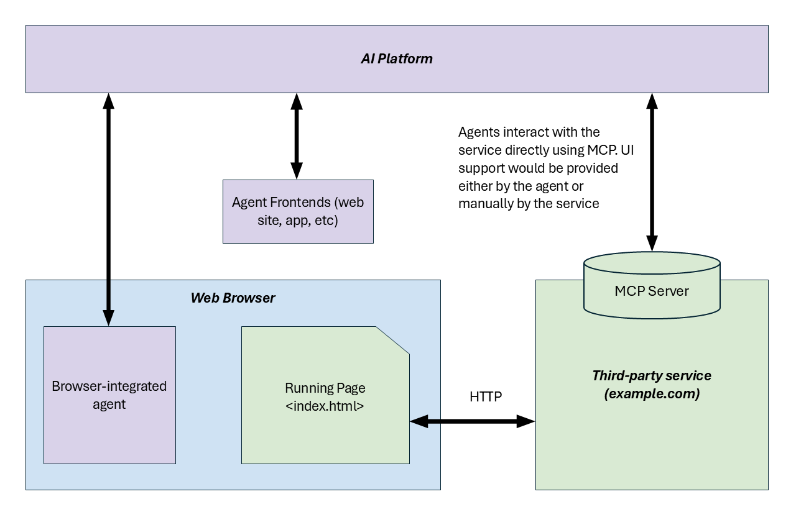

# WebMCP 🧪

WebMCP lets developers expose web application functionality—either JavaScript functions or HTML `<form>` elements—as "tools" with natural language descriptions and structured schemas, designed for AI agent ingestion. These tools can be invoked by AI agents, including those built into the browser, hosted in iframes, or running in extensions to actuate web content that was traditionally designed for human interaction.


## Background and Motivation

The web platform is the world's largest gateway to information and capabilities. Today, user experiences rely on visual layouts, mouse and touch interactions, and visual cues to communicate functionality and state, but as AI agents become prevalent, the potential for even greater user value is within reach. The motivation of WebMCP is to provide a lightweight way to adapt web content for use by AI agents.


### Backend Integrations vs. In-browser WebMCP Tools

AI platforms such as Copilot, ChatGPT, Claude, and Gemini are increasingly able to interact with external services to perform actions such as checking local weather, finding flight and hotel information, and providing driving directions. This is facilitated by "tools" that external services provide to extend the AI model’s capabilities, and give the AI domain-specific functionality that it cannot obtain on its own.

External tools integrate with each AI platform via bespoke **backend integrations**, such as [Model Context Protocol](https://modelcontextprotocol.io/) or [OpenAPI](https://www.openapis.org/). A service registers its tools with an AI platform, and the platform communicates directly with the service's backend servers via an API. In this document, we call this style of tool a “backend integration”; users make use of the tools by chatting with an AI, and the AI platform communicates with the service on the user's behalf.

Backend integrations work well for server-side actions, but they pose significant challenges for interactive web applications:

- **UI Disintermediation & Context Loss**: Backend integrations take place directly between the agent and the service, bypassing the service's web UI / browser experience.
- **Replication of State & Auth**: Web developers must replicate the user's state, active context, and authentication credentials on a separate server.
- **Developer Burden**: Exposing a site's client-side capabilities requires writing a dedicated backend server, rather than reusing familiar client-side JavaScript.

**WebMCP** introduces a client-side alternative. It allows web developers to define tools directly in the browser page's script. This enables visually rich, cooperative interplay between a user, a web page, and an agent with shared context. Page UI and content remain available to the agent for actuation, but the agent can use WebMCP tools to achieve the user's goals more directly, reliably, and quickly, as the tools are in a format more suited to the agent.

#### WebMCP In-browser tool flow


#### Direct backend MCP flow


Many challenges faced by assistive technology also apply to AI agents that struggle to navigate existing human-first interfaces when agent-first "tools" are not available. Even when agents succeed, simple operations often require multiple steps and can be slow or unreliable.

Web pages that use WebMCP can be thought of as in-page [Model Context Protocol (MCP)](https://modelcontextprotocol.io/introduction) servers that implement tools exposing client-side logic and DOM interaction rather than server-side APIs. WebMCP enables collaborative workflows where users and agents work together within the same web interface, leveraging existing application logic while maintaining shared context and user control.


## Goals & Non-Goals

### Goals

- **Enable human-in-the-loop workflows**: Support cooperative scenarios where users delegate tasks to AI agents while maintaining visibility, history, and control over web pages.
- **Simplify AI agent integration**: Enable AI agents to be more reliable and helpful by interacting with web sites through well-defined client-side tools instead of through brittle UI actuation (DOM scraping, simulated clicks).
- **Prevent web content disintermediation**: Prevent disintermediation of web apps by backend integrations by adapting front-ends for use by agents, rather than replacing them.
- **Minimize developer burden**: Any task that a user can accomplish through a page's UI can be turned into a tool by reusing much of the page's existing client-side code.
- **Improve accessibility through agents**: Enable agents to assist users of accessibility technology. WebMCP itself is not designed for ingestion by accessibility technology, nor is it designed to interact directly with a page's accessibility tree; rather, it enables agents to act as highly capable intermediaries (see [Issue #91](https://github.com/webmachinelearning/webmcp/issues/91)).

### Non-Goals

- **Headless browsing scenarios**: While it may be possible to run these tools in headless environments, this API is primarily designed for local browser workflows with a human in the loop.
- **Fully autonomous workflows**: The API is not intended for fully autonomous agents operating without human oversight or where a browser UI is not present.
- **Replacement of backend integrations**: WebMCP is designed to complement, not replace, existing backend-focused protocols like MCP.
- **Replacement of human interfaces**: The human web interface remains primary; agent tools augment rather than replace user interaction.


## Use Cases

WebMCP enables cooperative workflows where the user collaborates with the agent rather than completely delegating their goal to it.

### Creative & Graphic Design

Jen wants to create a yard sale flyer on `http://easely.example`. She wants to filter templates and make visual edits. Instead of navigating menus, she interacts with her browser's agent:
- **Jen**: "Show me templates that are spring themed and that prominently feature the date and time. They should be on a white background so I don't have to print in color."
- The website has registered a tool:
  ```js
  navigator.modelContext.registerTool({
    name: "filter-templates",
    description: "Filters the list of templates based on a natural language visual description.",
    inputSchema: {
      type: "object",
      properties: {
        description: { type: "string", description: "A visual description of templates to show." }
      },
      required: ["description"]
    },
    execute({ description }) {
      filterTemplatesInUI(description);
    }
  });
  ```
- The agent invokes `filter-templates` tool, and the UI instantly updates to show matching layouts.
- Once Jen selects a template, the agent notices another tool `edit-design(instructions)` has been registered. Jen asks the agent to make adjustments (e.g., enlarging dates, swapping clipart), which the agent coordinates via direct tool calls.

### E-Commerce & Tailored Shopping
Maya is shopping for dresses on `http://wildebloom.example/shop`.
- **Maya**: "Show me only dresses available in my size, and also show only the ones that would be appropriate for a cocktail-attire wedding."
- The page registers tools to search and display products:
  ```js
  navigator.modelContext.registerTool({
    name: "get-dresses",
    description: "Returns an array of product listings containing id, description, price, and photo.",
    inputSchema: {
      type: "object",
      properties: {
        size: { type: "number", description: "Optional EU dress size to filter by." },
        color: { type: "string", description: "Optional color to filter by." }
      }
    },
    async execute({ size, color }) {
      const response = await fetchDresses(size, color);
      return response.json();
    }
  });
  ```
- The agent calls `get-dresses` and filters the rich results to perfectly match "cocktail-attire wedding" using the returned natural language descriptions. It then calls a registered `show-dresses` tool to update the grid in Maya's active view.

### Specialized Developer Workflows
John is performing a code review in Gerrit. Specialized interfaces can be overwhelming.
- **John**: "Why are the Mac and Android trybots failing?"
- The page registers tools to inspect trybot statuses and retrieve logs:
  ```js
  navigator.modelContext.registerTool({
    name: "get-trybot-statuses",
    description: "Returns the current status of all trybot runs for the active patch.",
    inputSchema: { type: "object", properties: {} },
    execute() {
      return activePatch.getStatuses();
    }
  });
  ```
- The agent calls the tool, spots that the Android bot failed, calls a corresponding `get-failure-snippet` tool, and presents a clean error report directly in the chat context. John then instructs the agent to create a suggested edit to fix the missing build dependency, which the agent submits via a registered `add-suggested-edit` tool.


## Detailed Design

WebMCP introduces an imperative API on the web platform under `navigator.modelContext`. This interface allows pages to expose client-side actions that agents can discover and invoke in a secure, browser-mediated environment.

### Imperative Tool Registration: `navigator.modelContext`

A Model Context Provider registers tools by calling the `navigator.modelContext.registerTool()` method. 

```js
const controller = new AbortController();

navigator.modelContext.registerTool({
  name: "add-todo",
  description: "Add a new item to the user's active todo list",
  inputSchema: {
    type: "object",
    properties: {
      text: { type: "string", description: "The text content of the todo item" }
    },
    required: ["text"]
  },
  async execute({ text }) {
    // Reuse existing client-side application logic and update UI.
    await addTodoItemToCollection(text);
    
    return {
      content: [
        {
          type: "text",
          text: `Added todo item: "${text}" successfully.`
        }
      ]
    };
  }
}, { signal: controller.signal });

// To unregister the tool later, abort the signal.
// controller.abort();
```

### Lifecycle of a Tool Call
1. **Registration**: The web page registers one or more tools using `navigator.modelContext.registerTool()`.
2. **Discovery**: An agent connected to the page queries the browser to discover the active list of tools and their schemas.
3. **Invocation**: The agent requests a tool call, sending structured arguments matching the tool's `inputSchema`.
4. **Execution**: The browser mediates the call, invokes the tool's `execute` callback with the provided arguments, and executes client-side logic on the page.
5. **Response**: The page's callback returns structured results back to the agent, which processes them to continue collaborating with the user.

### Declarative API

For forms and standard HTML inputs, a declarative counterpart to the imperative API allows the browser to automatically synthesize tool definitions from `<form>` elements. This is detailed in the [Declarative API Explainer](./declarative-api-explainer.md). It will be soon folded into this explainer document.


## Alternatives Considered

### 1. Direct Adoption of the Backend MCP Specification
We considered directly adopting the full Model Context Protocol (MCP) spec in the browser without creating a web-native API. However:
- MCP was built primarily for server-to-client and stdio/SSE process communication. It lacks native web concepts like origins, standard browser permissions, DOM integration, and tab-level lifecycle management.
- Coupling a web API directly to an actively evolving backend protocol would hinder backward compatibility and platform stability.

Instead, WebMCP derives direct inspiration and shares a **common vocabulary** with MCP (e.g., tools, schemas, parameters), but provides a form-fitting, client-safe solution designed natively for the web platform.

### 2. Static Declarative Manifests
We considered declaring tools solely inside static manifest files (like the Web App Manifest). While useful for offline or background discovery:
- Static manifests prevent web developers from dynamically adding, updating, or removing tools based on the active page state or user authentication status.
- Manifests cannot contain executable code, meaning developers would still need an imperative way to register execution handlers.

Our current approach allows imperative script-based registration, with the potential for static declarations to be layered on in the future.

### 3. Event-Based Tool Execution (`'toolcall'`)
Another alternative was to handle tool execution exclusively via window-level events:
```js
navigator.agent.addEventListener('toolcall', async (e) => {
  if (e.name === 'add-todo') {
    e.respondWith(handleAddTodo(e.arguments));
  }
});
```
- *Disadvantages*: This approach separates a tool's schema declaration from its implementation, making it harder to keep definitions and code in sync. It also leads to large `switch-case` statement blocks in event handlers.
- *Hybrid Approach*: We may still consider a hybrid model where a `"toolcall"` event is dispatched on the window *before* falling back to executing the registered imperative `execute` callback, allowing advanced interception.


## Prior Art

- **Model Context Protocol (MCP)**: Developed by Anthropic, MCP is supported by Claude Desktop and enables applications to connect with AI models.
- **WebMCP (MCP-B)**: An open-source project (see [MCP-B](https://mcp-b.ai/)) implementing browser tab and extension transports for local in-page communication.
- **OpenAPI**: The standard specification for describing HTTP APIs, used in platform-specific extensions like ChatGPT Actions.
- **Agent2Agent (A2A) Protocol**: A protocol focused on connecting distinct autonomous AI agents to one another.


## Security and Privacy Considerations

Interacting with AI agents crosses traditional trust boundaries. Security, privacy, permissions policy, and origin isolation are crucial aspects of this proposal. 

For detailed discussions, see [Security & Privacy Considerations](./docs/security-privacy-considerations.md) and the active community updates in [PR #181](https://github.com/webmachinelearning/webmcp/pull/181).


## Open Questions

As the WebMCP proposal continues to evolve with community and stakeholder feedback, we are tracking several active design discussions and technical challenges:

- **Multimodal input/output**: AI agents are increasingly multimodal, and we should consider how tools can consume binary media as inputs and how to return them as outputs (e.g., audio, streams, media blobs, etc.). See [Issue #41](https://github.com/webmachinelearning/webmcp/issues/41), [Issue #86](https://github.com/webmachinelearning/webmcp/issues/86), and [Issue #81](https://github.com/webmachinelearning/webmcp/issues/81), and [Prompt API: Multimodal inputs](https://github.com/webmachinelearning/prompt-api#multimodal-inputs).

- **Cross-document tool response**: How should WebMCP handle tool responses when a tool (a form submission, for example) causes the page to navigate to another document? See [Issue #135](https://github.com/webmachinelearning/webmcp/issues/135).

- **Transferable/streamable tool inputs and outputs**: AI models inherently support streaming data. WebMCP should consider enabling streaming tool inputs and outputs (such as chunked generation or large data transfers) without blocking on a massive copy. See [Issue #82](https://github.com/webmachinelearning/webmcp/issues/82). See also [MCP discussion](https://github.com/modelcontextprotocol/modelcontextprotocol/discussions/263) and [MCP Apps streaming tool inputs](https://github.com/modelcontextprotocol/ext-apps/blob/main/specification/draft/apps.mdx#notifications-host--view).

- **Input and output schema validation**: Investigating native validation of tool inputs and outputs against declared JSON schemas before invoking the page's JS execution callback, or letting the output reach the model. See [Issue #92](https://github.com/webmachinelearning/webmcp/issues/92).

- **Skills Integration**: Determining if the author should expose a higher-level "skill" to help the agent coordinate multiple related tools to fulfill a user journey. See [Issue #161](https://github.com/webmachinelearning/webmcp/issues/161).

- **Output schema**: Supporting structured `outputSchema` contracts (complementing `inputSchema`) to help LLMs reliably reason about the return values of tools. See [Issue #9](https://github.com/webmachinelearning/webmcp/issues/9).

- **User prompting and elicitation**: Exploring a way for a tool to prompt the user for confirmation when tools require explicit user authorization. This could be done by delegating to the agent and its harness, or by invoking native browser permission dialogue outside of the agent loop. See [Issue #165](https://github.com/webmachinelearning/webmcp/issues/165) and [Issue #50](https://github.com/webmachinelearning/webmcp/issues/50).

- **Tool progress reporting**: For long-running tasks (e.g., batch processing or generating content), the agent may want a way to track a tool's progress. We are exploring how this intersects with the established [MCP Progress](https://modelcontextprotocol.io/specification/2025-11-25/basic/utilities/progress) specification.

- **Service workers integration**: Extending WebMCP to background Service Workers to allow agents to discover and invoke tools on sites the user doesn't currently have open. This is detailed in the supplementary [Service Workers Explainer](./docs/service-workers.md), which proposes background discovery mechanisms, session identification, and JIT worker installation.


## Acknowledgments

Many thanks to [Alex Nahas](https://github.com/MiguelsPizza) and [Jason McGhee](https://github.com/jasonjmcghee/) for sharing their valuable [implementation](https://github.com/MiguelsPizza/WebMCP) [experience](https://github.com/jasonjmcghee/WebMCP).

---

> First published August 13, 2025
>
> Brandon Walderman <code>&lt;brwalder@microsoft.com&gt;</code><br>
> Leo Lee <code>&lt;leo.lee@microsoft.com&gt;</code><br>
> Andrew Nolan <code>&lt;annolan@microsoft.com&gt;</code><br>
> David Bokan <code>&lt;bokan@google.com&gt;</code><br>
> Khushal Sagar <code>&lt;khushalsagar@google.com&gt;</code><br>
> Hannah Van Opstal <code>&lt;hvanopstal@google.com&gt;</code>
