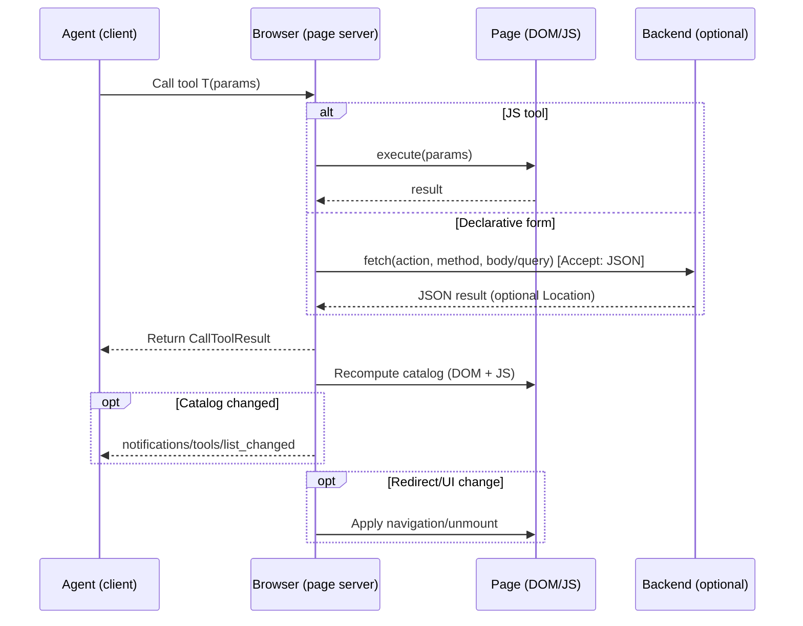
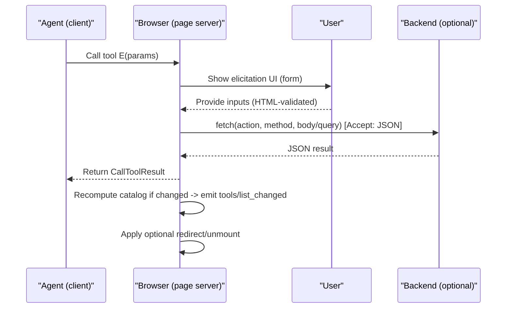

# Declarative WebMCP API Proposal — Draft

> September 16, 2025
>
>  <code>&lt;alexmnahas@gmail.com&gt;</code>

Status: Draft for discussion. This document proposes a minimal, declarative way for web pages to expose WebMCP tools directly from HTML. The core idea is simple: HTML is the contract. Agents derive parameter schemas from standard form/anchor semantics and validation. No custom validation attributes. Complex/edge cases remain the domain of JavaScript tools registered via [`window.mcp.registerTool`](./proposal.md) (or whatever API we end up with). For broader context, see the main explainer in `webmcp/README.md`.

Related: original proposal discussion — GitHub issue #22: https://github.com/webmachinelearning/webmcp/issues/22


## TL;DR

This HTML form declares a tool the browser can expose to agents:

```html
<form action="/todos" method="post"
      tool-name="add_todo"
      tool-title="Add Todo"
      tool-description="Create a todo item">
  <label>
    Text
    <input name="text" type="text" required minlength="3" maxlength="140">
  </label>
  <label>
    Priority
    <select name="priority">
      <option value="low">low</option>
      <option value="medium" selected>medium</option>
      <option value="high">high</option>
    </select>
  </label>
  <button type="submit">Add</button>
  <input type="hidden" name="projectId" value="123">
  <!-- The browser submits with Accept: application/json and delivers the MCP result first. -->
  <!-- No custom attributes beyond tool-*; constraints come from standard HTML. -->

</form>
```

Equivalent JavaScript tool definition (what the browser synthesizes conceptually):

```js
// Conceptual shape of the synthesized JS tool:
window.mcp.registerTool("add_todo", {
  description: "Create a todo item",
  inputSchema: {
    type: "object",
    additionalProperties: false,
    properties: {
      text: { type: "string", minLength: 3, maxLength: 140, description: "Text" },
      priority: { type: "string", enum: ["low", "medium", "high"] },
      projectId: { type: "string" }
    },
    required: ["text"]
  },
  async ({ text, priority = "medium", projectId }) => {
    const res = await fetch("/todos", {
      method: "POST",
      credentials: "include",
      headers: {
        "Accept": "application/json",
        "Content-Type": "application/json"
      },
      body: JSON.stringify({ text, priority, projectId })
    });
    return await res.json(); // MCP-compatible JSON
  }
});

```

## 0) Principles
- HTML is the single source of truth. If a human can submit it, an agent can submit it. Validation and structure come from ordinary HTML ([required](https://developer.mozilla.org/en-US/docs/Web/HTML/Reference/Attributes/required), [pattern](https://developer.mozilla.org/en-US/docs/Web/HTML/Reference/Attributes/pattern), [min](https://developer.mozilla.org/en-US/docs/Web/HTML/Reference/Attributes/min), [max](https://developer.mozilla.org/en-US/docs/Web/HTML/Reference/Attributes/max), [minlength](https://developer.mozilla.org/en-US/docs/Web/HTML/Reference/Attributes/minlength), [maxlength](https://developer.mozilla.org/en-US/docs/Web/HTML/Reference/Attributes/maxlength), [step](https://developer.mozilla.org/en-US/docs/Web/HTML/Reference/Attributes/step), [`<select>`](https://developer.mozilla.org/en-US/docs/Web/HTML/Element/select), [radio groups](https://developer.mozilla.org/en-US/docs/Web/HTML/Element/input/radio#defining_a_radio_group), repeated names, [`<fieldset>`](https://developer.mozilla.org/en-US/docs/Web/HTML/Element/fieldset) scoping, [hidden inputs](https://developer.mozilla.org/en-US/docs/Web/HTML/Element/input/hidden)).
- Only one required attribute: `tool-name` on [`<form>`](https://developer.mozilla.org/en-US/docs/Web/HTML/Element/form), [`<a>`](https://developer.mozilla.org/en-US/docs/Web/HTML/Element/a), or [`<button>`](https://developer.mozilla.org/en-US/docs/Web/HTML/Element/button). A title/description is optional. A tool exists only because it has a `tool-name`.
- Closed-world by construction. Parameters are exactly the controls present in the DOM (including hidden inputs). No [`additionalProperties`](https://json-schema.org/understanding-json-schema/reference/object#additional-properties). See also the [closed-world assumption](https://en.wikipedia.org/wiki/Closed-world_assumption).
- Describable fields. Each control may include `tool-param-title` and `tool-param-description` for UX and LLM hints. These do not override validation.
- Elicitation hints. Controls MAY include `tool-elicit` to require a human-in-the-loop confirmation/input for that field during agent execution. This is a UX hint only; it does not change validation or the synthesized schema. See §8.1.
- MCP alignment. Tools may include `tool-openworld` (default true) and other MCP-style annotations (`tool-readonly`, `tool-idempotent`, `tool-destructive`) that map to MCP hints in [`ToolAnnotations`](https://modelcontextprotocol.io/specification/2025-06-18/schema#toolannotations) — [openWorldHint](https://modelcontextprotocol.io/specification/2025-06-18/schema#toolannotations-openworldhint), [readOnlyHint](https://modelcontextprotocol.io/specification/2025-06-18/schema#toolannotations-readonlyhint), [idempotentHint](https://modelcontextprotocol.io/specification/2025-06-18/schema#toolannotations-idempotenthint), [destructiveHint](https://modelcontextprotocol.io/specification/2025-06-18/schema#toolannotations-destructivehint).
- Progressive enhancement. Works with or without JS. Agents call the tool; the browser submits with [`fetch`](https://developer.mozilla.org/en-US/docs/Web/API/fetch) ([credentials](https://developer.mozilla.org/en-US/docs/Web/API/Request/credentials) as usual) and [`Accept`](https://developer.mozilla.org/en-US/docs/Web/HTTP/Headers/Accept): `application/json`.
- When it gets fancy, use JS. Composition ([`oneOf`/`allOf`](https://json-schema.org/understanding-json-schema/reference/combining#allof)), streaming, cross-field logic → JavaScript-registered tools via [`window.mcp.registerTool`](./proposal.md) (page) or [`self.mcp.registerTool`](./service-workers.md) (service worker).

—

## 1) What counts as a declarative tool?
- `<form tool-name="…">` → a tool with structured parameters derived from its controls.
- `<a tool-name="…">` / `<button tool-name="…">` → a tool with no parameters (or parameters encoded in the URL/query at call time).

Only `tool-name` is required. `tool-title` / `tool-description` are optional and for display/LLM context.

—

## 2) Authoring — minimal attribute set

### 2.1 Tool declaration (on `<form>`, `<a>`, `<button>`)
- `tool-name` (required) — programmatic identifier (pattern `^[a-zA-Z0-9_.-]{1,64}$`).
- `tool-title` (optional) — human-readable name.
- `tool-description` (optional) — natural-language description.
- `tool-openworld` (optional, default true) — hint that results depend on mutable external state. Maps to MCP [`openWorldHint`](https://modelcontextprotocol.io/specification/2025-06-18/schema#toolannotations-openworldhint).
- `tool-readonly` (optional, default false) — hint that the action doesn’t change state. Maps to MCP [`readOnlyHint`](https://modelcontextprotocol.io/specification/2025-06-18/schema#toolannotations-readonlyhint).
- `tool-idempotent` (optional, default false) — hint that retries are safe. Maps to MCP [`idempotentHint`](https://modelcontextprotocol.io/specification/2025-06-18/schema#toolannotations-idempotenthint).
- `tool-destructive` (optional, default false) — hint that state is altered/deleted. Maps to MCP [`destructiveHint`](https://modelcontextprotocol.io/specification/2025-06-18/schema#toolannotations-destructivehint).

### 2.2 Parameter documentation (on controls)
- `tool-param-title` (optional) — short display title.
- `tool-param-description` (optional) — longer help text.
- `tool-param-type` (optional) — only to disambiguate (e.g., force integer for `type=number`). See JSON Schema numeric types: [`number`](https://json-schema.org/understanding-json-schema/reference/numeric#number) vs [`integer`](https://json-schema.org/understanding-json-schema/reference/numeric#integer).
- `tool-elicit` (optional, boolean) — if present, the browser MUST elicit/confirm this field from the user before submitting when invoked by an agent (see §8.1).

There are no `tool-param-*` validation attributes. HTML is the schema.

—

## 3) Schema synthesis (inference rules)

Types
- Input types → JSON Schema:
  - [`email`](https://developer.mozilla.org/en-US/docs/Web/HTML/Element/input/email) → string/email ([format](https://json-schema.org/understanding-json-schema/reference/string#format)); [`url`](https://developer.mozilla.org/en-US/docs/Web/HTML/Element/input/url) → string/uri ([format](https://json-schema.org/understanding-json-schema/reference/string#format)),
  - [`number`](https://developer.mozilla.org/en-US/docs/Web/HTML/Element/input/number) | [`range`](https://developer.mozilla.org/en-US/docs/Web/HTML/Element/input/range) → number|integer (infer integer when [`step`](https://developer.mozilla.org/en-US/docs/Web/HTML/Reference/Attributes/step) is a whole number),
  - [`date`](https://developer.mozilla.org/en-US/docs/Web/HTML/Element/input/date) → string/date; [`datetime-local`](https://developer.mozilla.org/en-US/docs/Web/HTML/Element/input/datetime-local) → string/date-time; [`time`](https://developer.mozilla.org/en-US/docs/Web/HTML/Element/input/time) → string/time,
- [`checkbox`](https://developer.mozilla.org/en-US/docs/Web/HTML/Element/input/checkbox) → boolean, [`file`](https://developer.mozilla.org/en-US/docs/Web/HTML/Element/input/file) → string (the browser MAY set `contentEncoding: base64`),
  - [`text`](https://developer.mozilla.org/en-US/docs/Web/HTML/Element/input/text) | [`search`](https://developer.mozilla.org/en-US/docs/Web/HTML/Element/input/search) | [`tel`](https://developer.mozilla.org/en-US/docs/Web/HTML/Element/input/tel) | [`password`](https://developer.mozilla.org/en-US/docs/Web/HTML/Element/input/password) | [`color`](https://developer.mozilla.org/en-US/docs/Web/HTML/Element/input/color) | [`month`](https://developer.mozilla.org/en-US/docs/Web/HTML/Element/input/month) | [`week`](https://developer.mozilla.org/en-US/docs/Web/HTML/Element/input/week) → string.
- `<textarea>` → string.
- [`<textarea>`](https://developer.mozilla.org/en-US/docs/Web/HTML/Element/textarea) → string.
- [`<select>`](https://developer.mozilla.org/en-US/docs/Web/HTML/Element/select) (single) → string with enum from options ([enum](https://json-schema.org/understanding-json-schema/reference/generic#enumerated-values)); `<select multiple>` → array<string>.
- Radio group (same name) → string with enum from radio values ([radio groups](https://developer.mozilla.org/en-US/docs/Web/HTML/Element/input/radio#defining_a_radio_group)).

Constraints
- [`required`](https://developer.mozilla.org/en-US/docs/Web/HTML/Reference/Attributes/required) → [`required`](https://json-schema.org/understanding-json-schema/reference/object#required) array.
- [`pattern`](https://developer.mozilla.org/en-US/docs/Web/HTML/Reference/Attributes/pattern) → [`pattern`](https://json-schema.org/understanding-json-schema/reference/regular_expressions).
- [`minlength`](https://developer.mozilla.org/en-US/docs/Web/HTML/Reference/Attributes/minlength)/[`maxlength`](https://developer.mozilla.org/en-US/docs/Web/HTML/Reference/Attributes/maxlength) → [`minLength`](https://json-schema.org/understanding-json-schema/reference/string#length)/[`maxLength`](https://json-schema.org/understanding-json-schema/reference/string#length).
- [`min`](https://developer.mozilla.org/en-US/docs/Web/HTML/Reference/Attributes/min)/[`max`](https://developer.mozilla.org/en-US/docs/Web/HTML/Reference/Attributes/max) → [`minimum`](https://json-schema.org/understanding-json-schema/reference/numeric#range)/[`maximum`](https://json-schema.org/understanding-json-schema/reference/numeric#range) (numbers/dates).
- [`step`](https://developer.mozilla.org/en-US/docs/Web/HTML/Reference/Attributes/step) → [`multipleOf`](https://json-schema.org/understanding-json-schema/reference/numeric#multipleof) (numbers) and integer inference.

Structure
- Object fields from [`fieldset[name]`](https://developer.mozilla.org/en-US/docs/Web/HTML/Element/fieldset) scoping and/or dot-notation (e.g., `address.street`).
- Arrays from repeated `name` controls or [`select[multiple]`](https://developer.mozilla.org/en-US/docs/Web/HTML/Element/select#multiple).

No overrides. The input schema equals what HTML expresses. To add agent-only data, include hidden inputs.

—

## 4) How a form is interpreted as a WebMCP tool
1. Discover: The browser finds `tool-name` elements and enumerates tools.
2. Synthesize: The browser walks controls → builds an input schema from HTML (types, constraints, structure).
3. Expose: The tool appears alongside JS tools on a common surface (MCP tools/list; see MCP Schema Reference: https://modelcontextprotocol.io/specification/2025-06-18/schema).
4. Invoke: Agent calls the tool with params → the browser submits with [`fetch`](https://developer.mozilla.org/en-US/docs/Web/API/fetch) to `action/method`.
   - GET: encode params in query.
   - Others: send FormData.
   The browser includes [`Accept`](https://developer.mozilla.org/en-US/docs/Web/HTTP/Headers/Accept): `application/json` and [credentials](https://developer.mozilla.org/en-US/docs/Web/API/Request/credentials) as usual.
   - If any control bears `[tool-elicit]`, the browser first elicits user input/confirmation for those fields before submission; see §8.1.
5. Return: The server responds with JSON → the browser returns an MCP CallToolResult to the agent (see Schema Reference: https://modelcontextprotocol.io/specification/2025-06-18/schema).
   UI navigation (if any) is applied after returning the result (see §6).

—

## 5) Examples

### 5.1 List via link (no params)

```html
<a href="/todos"
   tool-name="list_todos"
   tool-title="List Todos"
   tool-description="Return the current todos"
   tool-readonly>
  All Todos
</a>
```

Interpretation: Parameterless tool. The browser fetches `GET /todos` with [`Accept`](https://developer.mozilla.org/en-US/docs/Web/HTTP/Headers/Accept): `application/json` and returns the parsed body.

### 5.2 List with filters (query params)

```html
<form action="/todos" method="get"
      tool-name="filter_todos"
      tool-title="Filter Todos"
      tool-description="Filter by text and status">
  <input name="q" type="search" minlength="2" placeholder="Search">
  <select name="status">
    <option value="">Any</option>
    <option value="open">Open</option>
    <option value="done">Done</option>
  </select>
  <button type="submit">Apply</button>
</form>
```

Schema: `{ q?: string(minLength=2), status?: enum('', 'open', 'done') }`.

### 5.3 Create todo (closed-world object)

```html
<form action="/todos" method="post"
      tool-name="add_todo"
      tool-title="Add Todo"
      tool-description="Create a new todo"
      tool-openworld>
  <input name="description" type="text" required minlength="3" maxlength="140"
         tool-param-description="The todo text">
  <input name="projectId" type="hidden" value="123">
  <button type="submit">Add</button>
</form>
```

Schema: `{ description: string(3..140), projectId: string }`.

### 5.4 Pagination & sorting with HREF
```html
<a href="/todos?page=1&per=20&sort=createdAt&dir=desc"
   tool-name="list_todos_page"
   tool-title="List Todos (Page)">
  Page 1
</a>
```

## 6) Navigation & redirects

Default (what MCP-B does): Fetch-first, Defer Navigation
1. Submit with `fetch` + `Accept: application/json`, include credentials as usual.
2. Deliver the MCP result first to the agent.
3. If the server indicates a UI transition (e.g., [`_meta.uiRedirect`](https://modelcontextprotocol.io/specification/2025-06-18/basic/index#meta) or an HTTP [`Location`](https://developer.mozilla.org/en-US/docs/Web/HTTP/Headers/Location)), apply navigation after result delivery.

Server convention (for this draft)
- Return JSON for agent calls. See §8.2 for trade-offs.


## 6.1) Tool catalog and change notifications

Catalog definition
- The active tool catalog for a page-scoped WebMCP server is the union of:
  - Declarative HTML tools present in the current DOM (elements with `tool-name`).
  - JavaScript tools registered via `window.mcp.registerTool(...)` in that browsing context.
- Tool names MUST be unique within a catalog. If a name collision occurs, the browser SHOULD prefer the most recently registered definition and MAY surface a warning in DevTools.

>The MCP spec throws and error on tool name collision. We should probably do the same. Tool collisions are far more likely to happen in WebMCP servers as there is now up to three possible sources of tools: declarative, javascript, and service worker.

Change detection and ordering guarantees
- Tools can appear or disappear as a result of a tool call (e.g., DOM updates, conditional registration).
- To preserve correctness and avoid race conditions, the browser MUST enforce this ordering for a single tool invocation:
  1) Execute the tool and fully evaluate its body (JS `execute` or form submission/response parsing).
  2) Deliver the tool result to the client (agent) over MCP.
  3) Recompute the catalog (scan DOM + JS registrations), compute deltas, and if changed, emit [`notifications/tools/list_changed`](https://modelcontextprotocol.io/specification/2025-06-18/schema#notifications%2Ftools%2Flist-changed) to all connected clients for this server.
  4) Apply any navigation/unmounts/redirects (e.g., those implied by `_meta.uiRedirect` or HTTP redirects).
- In particular, the tool that is currently executing MUST NOT be unmounted (e.g., DOM removal or JS unregistration) until after its result has been delivered to the client and any [`notifications/tools/list_changed`](https://modelcontextprotocol.io/specification/2025-06-18/schema#notifications%2Ftools%2Flist-changed) notification has been sent.

Notification shape
- Method: [`notifications/tools/list_changed`](https://modelcontextprotocol.io/specification/2025-06-18/schema#notifications%2Ftools%2Flist-changed)
- Use when: any change to the catalog (addition, removal, or metadata/schema change) is observed after a recomputation.

```
interface ToolListChangedNotification {
  method: "notifications/tools/list_changed";
  params?: { _meta?: { [key: string]: unknown }; [key: string]: unknown };
}
```

Reference: MCP notification — notifications/tools/list_changed: https://modelcontextprotocol.io/specification/2025-06-18/schema#notifications%2Ftools%2Flist-changed

Sequence (tool call with catalog update and redirect)



## 6.2) Navigation strategies — Advantages & Disadvantages

Topic: When a tool call triggers navigation, should the browser broker state and guarantee result delivery before unmount, or allow the page to navigate/unmount mid-flight?

Strategy A — Fetch-first, Defer Navigation (current draft)
**Advantages:**
- Deterministic: agent always receives a result before any unmount/redirect.
- Simple agent contract: results first, then `tools/list_changed`, then navigation.
- Avoids race conditions and lost results across SPA/MPA transitions.

**Disadvantages:**
- Browser must “freeze” the invoking tool’s lifetime briefly; adds implementation complexity.
- Slightly delays visible navigation until result delivery.
- Page authors can’t forcibly interrupt an in-flight call (must cancel cooperatively).

Strategy B — Navigate-early (allow unmount during execution)
**Advantages:**
- Matches default web navigation behavior; minimal special handling.
- Lets the page control UX timing fully, including immediate redirects.

**Disadvantages:**
- Racy: results may be lost if the executing context unmounts.
- Inconsistent across sites; agents can’t rely on receiving results.
- Requires additional browser buffering or background handoff to be usable.

Strategy C — Service Worker broker (see service-workers.md)
**Advantages:**
- Robust to page unmount; execution continues in SW.
- Enables true background operation and offline support patterns.

**Disadvantages:**
- Requires a SW and session management; added complexity.
- Not all apps want or need SW scope; increases setup cost.

> I'm not a browser engineer, so all of my solutions are based on what I know to be available for web developers. I'd love some feedback on this from a browser engineer.

## 8) Return shape (MCP-compatible)

Return a JSON body compatible with MCP `CallToolResult`:

```json
{
  "content": [{ "type": "text", "text": "Created todo #42" }],
  "_meta": { "uiRedirect": "/todos" }
}
```

You may also include `structuredContent` for typed data (see MCP Schema Reference: https://modelcontextprotocol.io/specification/2025-06-18/schema).


## 8.1) Elicitation — flow

Declarative elicitation forms behave like an async function that first collects user input, then performs submission, then responds to the agent. This preserves the fetch-first/defer-navigation rules and catalog-update ordering in §6 and §6.1. See MCP [`ElicitResult`](https://modelcontextprotocol.io/specification/2025-06-18/schema#elicitresult) and `_meta` usage (https://modelcontextprotocol.io/specification/2025-06-18/basic/index#meta).

Sequence (elicitation form tool)



Notes
- Params passed by the agent are merged with user-provided values from the elicitation UI according to normal form submission semantics.
- Validation follows HTML rules; invalid inputs block submission and no MCP result is sent until corrected or canceled.
- On cancellation, return an MCP result with `isError: true` and a suitable message; no submission occurs.

### 8.1.1 Field-level elicitation hints (`tool-elicit`)

Goal: Let authors require a short, human-in-the-loop confirmation or input for specific fields when a tool is invoked by an agent.

Attribute
- `tool-elicit` (boolean, on interactive controls) — when present, the browser MUST present those fields in an elicitation UI before submitting. Agent-provided values prefill as defaults; the user can edit or confirm.

Semantics
- Scope: If any radio in a named group has `tool-elicit`, treat the entire group as elicited. For `<select>`, apply to the element. For repeated `name` controls (arrays), elicitation applies to the repeated set.
- Visibility: Ignore `tool-elicit` on non-interactive controls such as `input[type=hidden]`, `disabled`, or `readonly` controls. Authors should instead expose an interactive control if they want user input.
- Merging: Final submitted values come from the elicitation UI for elicited fields (prefilled by agent/defaults); all other fields submit resolved values from agent/defaults/DOM as usual.
- Validation: Standard HTML constraints gate submission. `required` still applies; `tool-elicit` doesn’t change schema.
- UX: The browser chooses the UI, but SHOULD display each elicited field’s label or `tool-param-title` and (optionally) `tool-param-description`.

Example — require human input for description (even if provided by the agent)

```html
<form action="/todos" method="post"
      tool-name="add_todo"
      tool-title="Add Todo"
      tool-description="Create a new todo">
  <label>
    Description
    <input name="description" type="text"
           required minlength="3" maxlength="140"
           tool-elicit
           tool-param-description="What needs to be done?">
  </label>
  <label>
    Priority
    <select name="priority">
      <option value="low">low</option>
      <option value="medium" selected>medium</option>
      <option value="high">high</option>
    </select>
  </label>
  <input type="hidden" name="projectId" value="123">
  <button type="submit">Add</button>
</form>
```

Behavior
- When an agent calls `add_todo`, the browser first opens an elicitation UI showing the Description field (prefilled with any provided value). The user must confirm or edit it. The browser then submits and returns the JSON result to the agent per §6/§8.

### 8.1.2 Pros & cons and alternatives

Pros
- Fine-grained control for sensitive/ambiguous fields without JS.
- Clear human-in-the-loop signal to agents; consistent with MCP `ElicitResult`.
- Composes with standard HTML validation and default values.

Cons
- Overuse can add friction; UA elicitation UIs may vary.
- Boolean hint may be too coarse for some apps (see alternatives).

Alternatives (non-normative)
- Form-level review: a form-level attribute (e.g., `tool-elicit="review"`) to require a one-step confirmation screen summarizing all resolved params. Simpler to implement, less precise than field-level hints.
- Graduated hints: allow values like `tool-elicit="required|preferred"` where `preferred` lets the browser/agent skip the prompt when confident or when the value is unchanged. Needs confidence signaling; likely a later extension.
- Agent policy: let agents decide what to elicit (privacy/safety policies) independent of author hints. Complements `tool-elicit`, but not a substitute when authors must require consent.

—

## 8.2) JSON responses — Advantages & Disadvantages

Topic: Should declarative tool submissions require JSON responses from servers?

**Advantages:**
- Unambiguous, typed results that map cleanly to MCP `CallToolResult` and optional `structuredContent`.
- Stable across navigations; easy to buffer and deliver before redirects.
- Simplifies agents and interop testing; fewer parsing heuristics.

**Disadvantages:**
- Legacy sites that only return HTML must add a JSON path or wrapper.
- Authors may need to duplicate existing endpoints or add content negotiation.
- Rich HTML responses (e.g., server-rendered previews) need separate rendering surfaces.

Possible mitigations (non-normative):
- Allow HTML for human navigation, but when the `Accept: application/json` header is present, return JSON; otherwise redirect with HTML.
- For non-JSON responses, treat as error for declarative tools and recommend JavaScript tools for custom extraction/streaming.


## 9) When to use JS tools instead
- Schema composition or conditional logic.
- Streaming/long-running operations.
- Cross-field validation or transformations.
- Custom encodings or binary payload flows.
- Complex authentication / multi-step flows.

Register JS tools with [`window.mcp.registerTool(...)`](./proposal.md) in a page, or [`self.mcp.registerTool(...)`](./service-workers.md) in a Service Worker (https://developer.mozilla.org/en-US/docs/Web/API/Service_Worker_API).


## 10) Open Questions & Concerns

- JSON vs HTML responses
  - Today: Agent submissions prefer `fetch` with `Accept: application/json` and return an MCP‑compatible body. This makes results reliable and typed (optional `structuredContent`).
  - Question: Should JSON be a MUST for declarative tools, or a SHOULD with HTML fallbacks? What if servers only return HTML?
  - Options:
    - Require JSON (simplest for agents; aligns with Section 8).
    - Allow HTML (if justified) with a minimal, standardized mechanism (TBD). Avoid prescribing specific fallback patterns until consensus.
  - Related: If HTML is allowed, document that output schemas and streaming are JS‑tool territory.

- Redirects and tool unmounting
  - We define ordering in §6/§6.1 so results are delivered before navigation/unmount.
  - Question: Is this a strict MUST across all contexts (page, iframe, SW), and how should browsers handle mid‑flight DOM removal or navigation? Do we need an explicit “freeze until result delivered” requirement for the invoking tool element?

- Element scope: beyond form/a/button
  - Current: Only `<form>`, `<a>`, and `<button>` with `tool-name` are declarative tools.
  - Question: Should any element with `tool-name` be recognized? If yes, how is the trigger defined (e.g., `tool-trigger="click|submit"`) and how do we keep semantics accessible and predictable? Simpler option: keep the minimal set (form/a/button) and leave custom interaction to JavaScript tools.

- Elicitation ownership and flow
- Declarative elicitation is modeled in §8.1 with a browser‑hosted form flow and HTML validation.
  - Questions:
    - Parameter precedence: how to merge agent‑provided params with user input and hidden fields in all cases?
    - Cancellation/timeouts: standardized error shape and UX expectations?
    - Custom UI: should pages be able to style/host elicitation vs a browser‑native surface? If so, via what hooks?
    - Field-level hints: should `tool-elicit` remain boolean, or support values like `required|preferred|review`? What interoperability expectations can we set if UAs interpret "preferred" differently?
    - Applicability: should `tool-elicit` be ignored on `type=hidden`/`readonly`/`disabled`, or should UAs surface a temporary editable control? What about arrays (repeated names) and radio groups?
    - Consent memory: should browsers remember confirmations (per site/field) to reduce repeat prompts? How would authors/agents reset that state?
    - Accessibility/i18n: requirements for labels, descriptions, and keyboard flows in UA-provided elicitation UIs.

- Generated function semantics
- Declarative tools behave like browser‑generated async functions; authors don’t write these directly.
  - Questions:
    - Do we need lifecycle hooks (before/after submit, transform params/result) without opting into full JS tools?
    - Or should we keep declarative minimal and recommend `window.mcp.registerTool` when authors need control?

- Service Worker handling
  - SWs can register JS tools (`self.mcp.registerTool`). For declarative tools that originate in a page, the browser handles submission with `fetch` and delivers results, then recomputes the catalog (§6.1).
  - Questions:
    - Should SWs be able to intercept declarative submissions to provide background behavior or offline support transparently?
    - How should redirects and `_meta.uiRedirect` be applied when a SW executes the tool versus a page context?
    - What’s the recommended pattern for SW‑initiated elicitation (opening a window vs returning an error signaling required UI)? See service‑workers.md for candidates.

- Output typing and schemas
  - Minimal spec avoids output schemas for declarative tools. Question: Do we need an optional attribute (e.g., `tool-output-schema` reference) for typed `structuredContent`, or should authors use JS tools whenever output typing matters?

- Discovery and catalog stability
  - We recompute the active catalog after each call and emit `notifications/tools/list_changed` (§6.1).
  - Question: Do we need limits or debouncing to avoid flapping catalogs on highly dynamic pages? Should browsers surface deltas to agents or only the event?

- Interop with legacy sites
  - Many sites won’t add JSON responses initially. Open question: If HTML is allowed, what minimal extraction hooks are required for a conforming browser?
