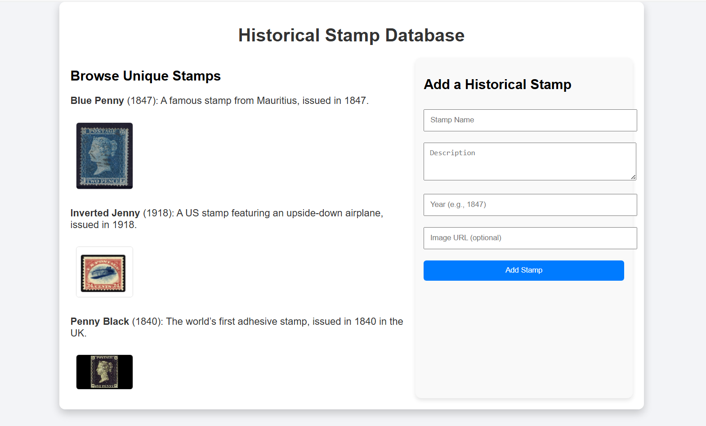

# WebMCP API Proposal

> August 13, 2025
>
> Brandon Walderman <code>&lt;brwalder@microsoft.com&gt;</code><br>
> Andrew Nolan <code>&lt;annolan@microsoft.com&gt;</code><br>
> David Bokan <code>&lt;bokan@google.com&gt;</code><br>
> Khushal Sagar <code>&lt;khushalsagar@google.com&gt;</code><br>
> Hannah Van Opstal <code>&lt;hvanopstal@google.com&gt;</code>

## Definitions

- **Model context provider**: A single top-level browsing context navigated to a page that uses the WebMCP API to provide context (i.e. tools) to agents.
- **Agent**: An application that uses the provided context. This may be something like an AI assistant integrated into the browser, or possibly a native/desktop application.  

## Understanding WebMCP

Only a top-level browsing context, such as a browser tab can be a model context provider. A page calls the WebMCP API's methods to register tools with the browser. An agent requires some information from the tool in order to use it. A simple, common subset emerges from [existing AI integration APIs](explainer.md#prior-art):

* A natural language description of the tool / function
* For each parameter:
  * A natural language description of the parameter
  * The expected type (e.g. Number, String, Enum, etc)
  * Any restrictions on the parameter (e.g. integers greater than 0)
* A JS callback function that implements the tool and returns a result

When an agent that is connected to the page sends a tool call, the JavaScript callback is invoked, where the page can handle the tool call and respond to the agent. The function can be asynchronous and return a promise, in which case the agent will receive the result once the promise is resolved. Simple applications can handle tool calls entirely in page script, but more complex applications may choose to delegate computationally heavy operations to workers and respond to the agent asynchronously.

Handling tool calls in the main thread with the option of delegating to workers serves a few purposes:

- Ensures tool calls run one at a time and sequentially.
- The page can update UI to reflect state changes performed by tools.
- Handling tool calls in page script may be sufficient for simple applications.

## Benefits of this design

- **Familiar language/tools**: Lets a web developer implement their tools in JavaScript.
- **Code reuse**: A web developer may only need to make minimal changes to expose existing functionality as tools if their page already has an appropriate JavaScript function.
- **Local tool call handling**: Enables web developers to integrate their pages with AI-based agents by working with, but not solely relying on, techniques like Model Context Protocol that require a separate server and authentication. A web developer may only need to maintain one codebase for their frontend UI and agent integration, improving maintainability and quality-of-life for the developer. Local handling also potentially reduces network calls and enhances privacy/security.
- **Fine-grained permissions**: Tool calls are mediated through the browser, so the user has the opportunity to review the requesting client apps and provide consent.
- **Developer involvement**: Encourages developer involvement in the agentic web, required for a thriving web. Reduces the need for solutions like UI automation where the developer is not involved, improving privacy, reducing site expenses, and a better customer experience.
- **Seamless integration**: Since tool calls are handled locally on a real browser, the agent can interleave these calls with human input when necessary (e.g. for consent, auth flows, dialogs, etc.).
- **Accessibility**: Bringing tools to webpages via may help users with accessibility needs by allowing them to complete the same job-to-be-done via agentic or conversational interfaces instead of relying on the accessibility tree, which many websites have not implemented.

## Limitations of this design

- **Browsing context required**: Since tool calls are handled in JavaScript, a browsing context (i.e. a browser tab or a webview) must be opened. There is currently no support for agents or assistive tools to call tools "headlessly" without visible browser UI. This is a future consideration which is discussed further below.
- **UI synchronization**: For a satisfactory end user experience, web developers need to ensure their UI is updated to reflect the current app state, regardless of whether the state updates came from human interaction or from a tool call.
- **Complexity overhead**: In cases where the site UI is very complex, developers will likely need to do some refactoring or add JavaScript that handles app and UI state with appropriate outputs.
- **Tool discoverability**: There is no built-in mechanism for client applications to discover which sites provide callable tools without visiting or querying them directly. Search engines, or directories of some kind may play a role in helping client applications determine whether a site has relevant tools for the task it is trying to perform.

## API

### modelContext
The `window.navigator.modelContext` interface is introduced for the site to declare functionality that can be used by an AI Agent. Access to these tools is arbitrated by the browser. The `modelContext` object has a `provideContext` method that's used to update the context (currently just tools) available to these agents. The method takes an object with a `tools` property which is a list of tool descriptors. The tool descriptors look as shown in this example below, which aligns with the Prompt API's [tool use](https://github.com/webmachinelearning/prompt-api#tool-use) specification, and other libraries like the MCP SDK:

```js
// Declare tool schema and implementation functions.
window.navigator.modelContext.provideContext({
    tools: [
        {
            name: "add-todo",
            description: "Add a new todo item to the list",
            inputSchema: {
                type: "object",
                properties: {
                    text: { type: "string", description: "The text of the todo item" }
                },
                required: ["text"]
            },
            execute: async execute({ text }, agent) => {
                // Add todo item and update UI.
                return /* structured content response */
            }
        }
    ]
});
```

The `provideContext` method can be called multiple times. Subsequent calls clear any pre-existing tools and other context before registering the new ones. This is useful for single-page web apps that frequently change UI state and could benefit from presenting different tools depending on which state the UI is currently in. For a list of tools passed to `provideContext`, each tool name in the list is expected to be unique.

Alternatively, the `registerTool`/`unregisterTool` APIs can be used to add/remove tools from the registered set without resetting the state entirely.

```js
window.navigator.modelContext.registerTool({
      execute:
        async execute({ text }, agent) => {
          // Add todo item and update UI.
          return /* structured content response */
        },
      name: "add-todo",
      description: "Add a new todo item to the list",
      inputSchema: {
        type: "object",
        properties: {
          text: { type: "string", description: "The text of the todo item" }
        },
          required: ["text"]
        },
    });

window.navigator.modelContext.unregisterTool("add-todo");
```
### agent
The `agent` interface is introduced to represent an AI Agent using the functionality declared by the site through the `modelContext`. The lifetime of this interface is scoped to the execution of a tool. It is passed as a parameter when executing a tool's function. This interface provides the dependencies required by the site from the Agent.

The `agent` provides a `requestUserInteraction` API to asynchronously seek user input during the execution of a tool. The API can be invoked multiple times during the execution of a tool.

```js
  navigator.modelContext.registerTool({
    execute: buyProduct,
    name: "buyProduct",
    description: "Use this tool to purchase a product given its unique product_id.",
    inputSchema: {
      type: "object",
      properties: {
        "product_id": {
          description: "The unique identifier for the product to be purchased.",
          type: "string",
        }
      },
      required: ["product_id"]
    },
  });
async function buyProduct(input, agent) {
  // Request user confirmation before executing the action.
  const confirmed = await agent.requestUserInteraction(async () => {
    return new Promise((resolve) => {
      const confirmed = confirm(`Buy product ${product_id}?\nClick OK to confirm, Cancel to abort.`);
      resolve(confirmed);
    });
  });

  if (!confirmed) {
    throw new Error("Purchase cancelled by user.");
  }

  executePurchase(product_id);
  return `Product ${product_id} purchased.`;
}
```

## Alternatives Considered
One disadvantage of the current registration approach is that the browser must navigate to the page and run JavaScript to discover tools. If WebMCP gains traction in the web developer community, it will become important to have a way to discover which sites have tools that are relevant to a user's request. Discovery is a topic that may warrant its own explainer, but suffice to say, it may be beneficial to have a way to know what capabilities a page offers without having to navigate to the web site first. As an example, a future iteration of this feature could introduce declarative tools definitions that are placed in an app manifest so that agents would only need to fetch the manifest with a simple HTTP GET request. Agents will of course still need to navigate to the site to actually use its tools, but a manifest makes it far less costly to discover these tools and reason about their relevance to the user's task.

To make such a scenario easier, it would be beneficial to consider an alternate means of tool call execution; one that separates the tool defintion and schema (which may exist in an external manifest file) from the implementation function.

One way to do this is to handle tool calls as events, as shown below:

```json
// 1. manifest.json: Define tools declaratively. Exact syntax TBD.

{
    // .. other manifest fields ..
    "tools": [
        {
            "name": "add-todo",
            "description": "Add a new todo item to the list",
            "inputSchema": {
                "type": "object",
                "properties": {
                    "text": { "type": "string", "description": "The text of the todo item" }
                },
                "required": ["text"]
            },
        }
    ]
}
```

```js
// 2. script.js: Handle tool calls as events.

window.agent.addEventListener('toolcall', async e => {
    if (e.name === "add-todo") {
        // Add todo item and update UI.
        e.respondWith(/* structured content response */);
        return;
    } // etc...
});
```

Tool calls are handled as events. Since event handler functions can't respond to the agent by returning a value directly, the `'toolcall'` event object has a `respondWith()` method that needs to be called to signal completion and respond to the agent. This is based on the existing service worker `'fetch'` event.

**Advantages:**

- Allows additional context different discovery mechanisms without rendering a page.

**Disadvantages:**

- Slightly harder to keep definition and implementation in sync.
- Potentially large switch-case in event handler.

### Open Question

A **hybrid** approach of both of the examples above should be considered as this would make it easy for web developers to get started adding tools to their page, while leaving open the possibility of manifest-based approaches in the future. To implement this hybrid approach, a `"toolcall"` event is dispatched on every incoming tool call _before_ executing the tool's `execute` function. The event handler can handle the tool call by calling the event's `preventDefault()` method, and then responding to the agent with `respondWith()` as shown above. If the event handler does not call `preventDefault()` then the browser's default behavior for tool calls will occur. The `execute` function for the requested tool is called. If a tool with the requested name does not exist, then the browser responds to the agent with an error.

## Example of WebMCP API usage

Consider a web application like an example Historical Stamp Database. TODO(brwalder): Port the source code for example here.



The page shows the stamps currently in the database and has a form to add a new stamp to the database. The author of this app is interested in leveraging the WebMCP API to enable agentic scenarios like:

- Importing multiple stamps from outside data sources
- Back-filling missing images
- Populating/correcting descriptions with deep research
- Adding information to descriptions about rarity
- Allowing end users to engage in a conversational interface about the stamps on the site and use that information in agentic flows

Using the WebMCP API, the author can add just a few simple tools to the page for adding, updating, and retrieving stamps. With these relatively simple tools, an AI agent would have the ability to perform complex tasks like the ones illustrated above on behalf of the user.

The example below walks through adding one such tool, the "add-stamp" tool, using the WebMCP API, so that AI agents can update the stamp collection.

The webpage today is designed with a visual UX in mind. It uses simple JavaScript with a `'submit'` event handler that reads the form fields, adds the new record, and refreshes the UI:

```js
document.getElementById('addStampForm').addEventListener('submit', (event) => {
    event.preventDefault();

    const stampName = document.getElementById('stampName').value;
    const stampDescription = document.getElementById('stampDescription').value;
    const stampYear = document.getElementById('stampYear').value;
    const stampImageUrl = document.getElementById('stampImageUrl').value;

    addStamp(stampName, stampDescription, stampYear, stampImageUrl);
});
```

To facilitate code reuse, the developer has already extracted the code to add a stamp and refresh the UI into a helper function `addStamp()`:

```js
function addStamp(stampName, stampDescription, stampYear, stampImageUrl) {
      // Add the new stamp to the collection
    stamps.push({
        name: stampName,
        description: stampDescription,
        year: stampYear,
        imageUrl: stampImageUrl || null
    });

    // Confirm addition and update the collection
    document.getElementById('confirmationMessage').textContent = `Stamp "${stampName}" added successfully!`;
    renderStamps();
}
```

To let AI agents use this functionality, the author defines the available tools. The `agent` property on the `Window` is checked to ensure the browser supports WebMCP. If supported, the `provideContext()` method is called, passing in an array of tools with a single item, a definition for the new "Add Stamp" tool. The tool accepts as parameters the same set of fields that are present in the HTML form, since this tool and the form should be functionally equivalent.

```js
if ("modelContext" in window) {
    window.modelContext.provideContext({
        tools: [
            {
                name: "add-stamp",
                description: "Add a new stamp to the collection",
                inputSchema: {
                    type: "object",
                    properties: {
                        name: { type: "string", description: "The name of the stamp" },
                        description: { type: "string", description: "A brief description of the stamp" },
                        year: { type: "number", description: "The year the stamp was issued" },
                        imageUrl: { type: "string", description: "An optional image URL for the stamp" }
                    },
                    required: ["name", "description", "year"]
                },
                async execute({ name, description, year, imageUrl }, agent) {
                    // TODO
                }
            }
        ]
    });
}
```

Now the author needs to implement the tool. The tool needs to update the stamp database, and refresh the UI to reflect the change to the database. Since the code to do this is already available in the `addStamp()` function written earlier, the tool implementation is very simple and just needs to call this helper when an "add-stamp" tool call is received. After calling the helper, the tool needs to signal completion and should also provide some sort of feedback to the client application that requested the tool call. It returns a text message indicating the stamp was added:

```js
async execute({ name, description, year, imageUrl }, agent) {
    addStamp(name, description, year, imageUrl);

    return {
        content: [
            {
                type: "text",
                text: `Stamp "${name}" added successfully! The collection now contains ${stamps.length} stamps.`,
            },
        ]
    };
}
```
### Future improvements to this example

#### Use a worker

To improve the user experience and make it possible for the stamp application to handle a large number of tool calls without tying up the document's main thread, the web developer may choose to move the tool handling into a dedicated worker script. Handling tool calls in a worker keeps the UI responsive, and makes it possible to handle potentially long-running operations. For example, if the user asks an AI agent to add a list of hundreds of stamps from an external source such as a spreadsheet, this will result in hundreds of tool calls.

#### Adaptive UI

The author may also wish to change the on-page user experience when a client is connected. For example, if the user is interacting with the page primarily through an AI agent or assistive tool, then the author might choose to disable or hide the HTML form input and use more of the available space to show the stamp collection.

## Intersection with MCP

MCP is a layered protocol enabling client-server communication. The client owns the AI Agent connecting to external systems using this protocol and the server is the external system. The protocol has the following layers:

- Primitives like tools (executable APIs), resources (static context) and prompts (templates for system prompts).
- Data layer for control messages between the client and server. For example, the client sends a `tools/list` message to request the set of tools from the server.
- Transport layer to abstract how the control messages are exchanged between the client-server (for example, HTTP POST requests).

This proposal aligns the Web API closely with MCP primitives. This ensures agentic capabilities on the Web declared via WebMCP can be used by any MCP compatible Agent with minimal translation layers; and makes it easier for web authors to reuse code with their MCP service.

Implementation of the data layer to arbitrate access to these primitives for an Agent is left to the browser. This design has the following advantages:

1. It doesn’t directly couple the Web to a specific MCP version. The fact that the control flow is intermediated by the browser, instead of being opaque messages exchanged between the site and the Agent, allows the browser to maintain backwards compatibility as the protocol evolves.
2. The browser can apply security policies unique to the web platform. For example, embedders would need to manage the capabilities provided to iframes.
3. The API ergonomics can align with the Web platform. For example, tool response can use `img` or `video` elements for multi-modal output.
4. There can be a declarative counterpart to imperative tools, see [issue 22](https://github.com/webmachinelearning/webmcp/issues/22).

## Other API Alternatives considered

### Web App Manifest, other manifest-based or declarative approaches

We considered declaring tools statically in a site's Web App Manifest. Declaring tools solely in the Web App Manifest limits WebMCP to PWAs which could impact adoption since users would need to install a site as an app for tools to be available.

Another type of manifest could be proposed but using this approach also means that only a fixed set of static tools are available and can't be updated dynamically based on application state, which seems like an important ability for web developers. Since manifests can't execute code, it also means manifests are additional work for the developer since they will need to still implement the tool somewhere.

Our recommended approach above allows for the possibility of declarative tools in the future while giving web developers as much control as possible by defining tools in script.

### Handling tool calls in worker threads

Handling tool calls on the main thread raises performance concerns, especially if an agent requests a large amount of tool calls in sequence, and/or the tools are computationally expensive. A design alternative that required tool calls to be handled in workers was considered instead.

One proposal was to expose the WebMCP API only in service workers and let the service worker post messages to individual client windows/tabs as needed in order to update UI. This would have complicated the architecture and required web developers to add a service worker. This would also have required the Session concept described earlier to help the service worker differentiate between agents that are connected to different windows and dispatch requests from a particular agent to the correct window.

For long-running, batched, or expensive tool calls, we expect web developers will dynamically update their UI when these are taking place to temporarily cede control to the agent (e.g. disable or remove human form inputs, indicate via UI that an agent is in control), and take advantage of dedicated workers as needed to offload expensive operations. This can be achieved with existing dedicated or shared workers.

## Acknowledgments

Many thanks to [Alex Nahas](https://github.com/MiguelsPizza) and [Jason McGhee](https://github.com/jasonjmcghee/) for sharing related [implementation](https://github.com/MiguelsPizza/WebMCP) [experience](https://github.com/jasonjmcghee/WebMCP).
