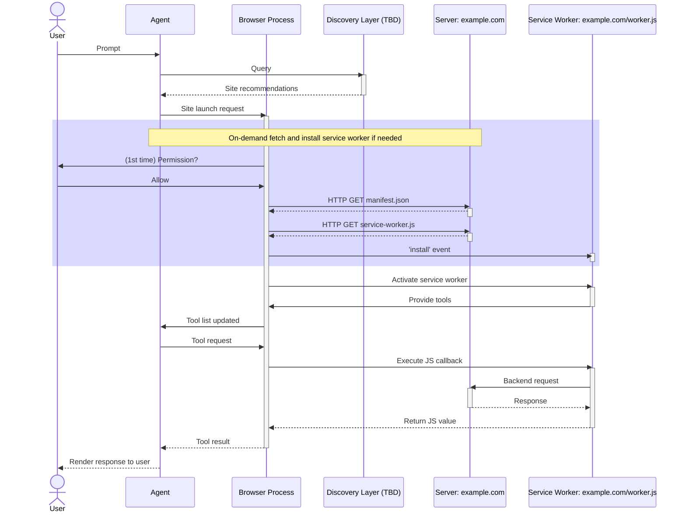

# WebMCP for Service Workers

> First published August 28, 2025
>
> Brandon Walderman <code>&lt;brwalder@microsoft.com&gt;</code><br>

This is a supplemental explainer for the main WebMCP explainer at https://github.com/webmachinelearning/webmcp.

## The Problem

The initial explainer for [WebMCP](https://github.com/webmachinelearning/webmcp) covers how web pages expose context to AI agents that are already browsing a page. WebMCP's design makes it possible for in-browser AI integrations such as sidebar assistants to access context on currently opened browser tabs, and to operate the pages within those tabs.

Sometimes, an agent may require context and tools from a site that the user doesn't currently have open. Perhaps the user is currently viewing a potential campsite on their favorite maps app and would like the agent to attempt to make a reservation while they continue to explore the map for potential nearby hikes. Ideally, the agent should be able to send a reservation request without navigating the tab or opening a new tab, either of which can be distracting to the user. What's needed is a way for the agent to discover an app that can handle the reservation request and a way to send that request in the background without necessarily showing any UI.

## TL;DR

This explainer describes a means for web sites to register service workers as WebMCP providers. Tool calls are handled in the service worker script where the web developer can handle the call directly, without needing to open any browser windows. If a tool requires user interaction though, the web developer can have their tool's execute function open a browser window and communicate with it via postMessage; For example, to let the user take care of sensitive steps like payment, or to present purchase confirmation.

## Use Cases

### Example – Productivity

_Sarah is working on her laptop and needs to quickly capture some tasks without interrupting her current workflow. She's not currently on her todo list app, but the todo list app has previously registered WebMCP tools with the browser that the agent can use._

**Sarah**: Add "Pick up dry cleaning" and "Call dentist about appointment" to my todo list.

_The agent recognizes that `http://todoapp.example` has registered tools via its service worker. The service worker has exposed the following tool:_

```javascript
/**
 * Adds a single item to the user's todo list.
 * 
 * item - A string representing the task to add to the list
 * priority - Optional priority level: "low", "medium", "high". Defaults to "medium"  
 * due_date - Optional due date in ISO format (YYYY-MM-DD)
 */
addTodoItem(item, priority, due_date)
```

_The agent calls `addTodoItem("Pick up dry cleaning", "medium")` and `addTodoItem("Call dentist about appointment", "medium")`. The service worker receives these calls and:_

1.	Updates the user's locally stored todo list data
2.	Syncs the changes with the app's backend API if network is available
3.	Shows system notifications that the items were added

**Agent**: Done! I've added both tasks to your todo list.

_Sarah continues her work uninterrupted. Later, when she opens her todo app in a browser tab, the new items are already there, having been synced in the background._

This demonstrates how service workers can handle tool calls entirely in the background, providing immediate value without requiring UI navigation or interrupting the user's current context. The service worker acts as an always-available local MCP service that can manage app state and provide simple user feedback through system notifications.

### Example – Grocery Shopping

_Mike is working from home and realizes he needs to order groceries for delivery. He wants to delegate meal planning and shopping to his agent but will need to review and complete the purchase manually._

**Mike**: Plan this week's meals for me and order all the needed ingredients.

_The agent recognizes that `http://freshmart.example` has registered tools via its service worker. The service worker has exposed several tools:_

```javascript
/**
 * Searches for available products matching the given item name.
 * 
 * item_name - A string describing the product to search for
 * returns - Array of products with id, name, price, and availability
 */
searchProducts(item_name)

/**
 * Adds a specific product to the user's shopping cart.
 * 
 * product_id - The ID of the product to add to cart
 * quantity - Number of items to add (defaults to 1)
 */
addToCart(product_id, quantity)

/**
 * Initiates the order placement process. Opens a secure payment window
 * if payment information is needed from the user.
 * 
 * returns - Completes the order or opens a payment interface as needed
 */
placeOrder()
```

_The agent performs the following sequence:_

1.	Plans a week's worth of meals based on Mike's preferences (stored from previous interactions)
2.	Calls `searchProducts("chicken breast")`, `searchProducts("rice")`, `searchProducts("broccoli")`, etc. for each ingredient needed
3.	Selects appropriate products from the results and calls `addToCart(product_id, 1)` for each item
4.	The service worker updates the cart via backend API calls
5.	Finally calls `placeOrder()`

_The service worker handles the `placeOrder()` call by:_

1.	Checking if the user has saved payment information on file
2.	Since Mike doesn't have a payment method saved, opening a new browser window to `http://freshmart.example/checkout`
3.	Pre-populating the cart data and delivery preferences already stored on Mike's account, but leaving payment fields empty for manual entry
4.	Presenting a secure payment interface where Mike can enter his credit card details and choose to save them for future orders

_Mike now has a secure checkout window open with his cart and delivery details pre-populated. He can review the meal ingredients the agent selected, enter his payment information, and choose to save it for future orders. Importantly, the agent never sees or handles any payment credentials, ensuring secure transactions while still automating the tedious parts of meal planning and shopping. Once the payment flow is completed in the browser window, it signals the service worker via postMessage so that the service worker can complete the placeOrder() call._

**Agent**: I've planned your meals for the week and added all the needed ingredients to your grocery cart. Your order is confirmed and is being processed.

This demonstrates how service workers can handle complex workflows that combine background operations (meal planning, product search, cart management) with secure UI handoffs for sensitive operations. The agent can complete most of the shopping process automatically, but payment details remain private and secure through traditional web interfaces.

## Proposal

### Discovery and Installation

For a service worker to provide WebMCP tools, the service worker must first be installed. Installation typically happens when a user first navigates to a web site that uses the `navigator.serviceWorker.register()` method. Although service workers are often associated with PWAs, a site doesn't necessarily need to be a PWA to register a service worker. Also, once registered, the same service worker may serve both tabbed pages, and standalone app windows at the same time. 

Service workers installed in this way can provide tools, but this approach is limited because the user must explicitly seek out a site with the tools they need and navigate to the site at least once. To facilitate a better user experience, it would be helpful to provide agents with a means to discover and recommend relevant sites for the user and give the user the option to install these sites on demand.

The experimental [Payment Handler API](https://developer.mozilla.org/en-US/docs/Web/API/Payment_Handler_API) has already introduced the ["serviceworker"](https://developer.mozilla.org/en-US/docs/Web/Progressive_web_apps/Manifest/Reference/serviceworker) app manifest field which is used for Just-In-Time (JIT) registering of service workers to handle payment requests. The app manifest includes the URL for a service worker script so that the browser can directly fetch it and then install the service worker without requiring the user to navigate to a page first:

```json
{
  "name": "Example App",
  "description": "This is an example WebMCP app.",
  "start_url": "/",
  "serviceworker": {
    "src": "service-worker.js",
    "scope": "/",
    "use_cache": false
  }
}
```

Building on this approach, a new field could be added to web app manifests to indicate that a web app supports WebMCP (i.e. has tools). This information can be used to help build discovery mechanisms such as directories or search APIs that agents can then use to look up sites with relevant tools. More notes on discovery later in this explainer.

The output of this hypothetical discovery step is the URL of a web app manifest with the relevant fields. Once the agent has discovered and fetched this manifest, it can use the `"serviceworker"` info within to install the service worker in the user's browser, at which point it can begin handling tool requests. The exact means of discovering a site and installing its service worker are TBD. Some options are discussed in Appendix A. Assuming a service worker has successfully been installed, the complete flow for tool call handling is described below.

### Tool Registration and Use

Service workers have a new `agent` object available in their global scope; the same `agent` object as specified in the original WebMCP explainer. When the service worker is activated, the worker script can call the `agent` object's methods to register tools with the browser. These tools are then available for use by in-browser AI agents.

Tools are scoped to the service worker and origin that created them, so it's not possible for a single app to squat common tool names like "search" or "add-to-cart". On the agent side, each conversation should have a limited set of WebMCP service workers connected which are relevant to the topic of the conversation. This prevents giving the agent more privileges than necessary and conserves the LLMs limited context window. Service worker selection may happen either automatically based on the agent's suggestions or manually based on user configuration. If two or more WebMCP service workers with similar tools and purposes are enabled in the same conversation, then agents may resolve the ambiguity by asking the user to pick one and remember their preference; much like how users choose a default browser for their OS. 

The complete flow, including JIT installation of service workers, is illustrated below. The Discovery Layer is a placeholder for now. It represents some entity that can recommend apps. Some possibilities for the discovery layer are described in Appendix A.



### Routing

In the initial WebMCP API proposal, tools are associated with a web page in a specific tab/window, and there is an implicit 1:1 mapping between the page, and an AI assistant operating that page. In other words, tool calls are handled only by one page and are sent from only one agent.

Service workers aren't associated with any particular window; they are associated with an origin (and optionally, a scope path). Tool requests that are addressed to a service worker may come from multiple different client agents and may be interleaved in arbitrary ways. 

Adding to this complexity, a web developer may register tools both in the service worker context, and page contexts. An implementation will need to handle ambiguity when both service workers and pages provide similar tools.

A browser process may have one or more tabs opened to the same site and may also have a service worker installed for that site. Each of these may have WebMCP tools (some of which are the same), but each tab/worker can be thought of as separate MCP servers. Which of these server(s) receive tool calls will depend on how/whether any MCP clients have connected to them. There are a few possibilities:

#### Single tab with on-page tools

This is the simplest architecture; a 1:1 mapping. A page with tools is opened in a tab. The in-browser agent can access these tools, and only these tools, and it is the only agent that can do so. In this case, routing is simple. All tool calls go to the currently active page.

#### Service worker only

In this architecture there's only one WebMCP "server" to consider; the service worker. Unlike the single tab case though, any number of in-browser and possibly even external agents (OS-integrated, or third-party apps) may want to connect to this service worker. All tool calls are routed to the service worker. 

#### Tabs plus service worker

In cases where there are tabs opened to a site, and that site also has a service worker installed, ambiguity may arise if a single agent is connected to both. Which "server" should handle a tool call if the agent determines that both servers have a relevant tool? This decision rests with the client agent and so may be very implementation specific. A simple solution is for the agent to ask the user which tool to use when more than one tool can handle their request. A more advanced solution may employ memory/context to choose which server to send the tool call to. For example, if the user has their email opened in a tab, but that email app is also installed as a PWA with a service worker, then either server can handle a request to send an email. However, if the user has already begun drafting an email to their manager in the opened tab, and they ask the agent to "email my current status to my manager", the agent may "see" this and choose to call the tool within the opened tab.

In any case, a single tool call is never routed to more than one server, even if the client is connected to multiple servers that have tools registered under the same name.

## Session Management

To implement certain kinds of multi-step workflows, it may be necessary for the service worker to maintain separate state for each client. For example, consider a user that has started two separate conversations with their browser's AI assistant; one to shop for birthday gifts, and one to shop for groceries. In both conversations, the assistant agent is interacting with the same shopping site through its service worker. Since tool calls from both conversations are handled centrally in the same service worker script context, the tool calls need to carry some kind of unique identifier (think session ID) so that the service worker can maintain two separate shopping carts and ensure that it reads/write to the correct one depending on which conversation (i.e. session) the tool request came from.

A solution would be to add a Session ID to tool calls and include this information as a parameter to tools' execute functions. Now, when a tool call is handled, the function has both the input parameters of the tool call, and client info with a session ID which it can use to cache state unique to that session (i.e. the user's shopping cart in the example above).

```js
self.agent.provideContext({
  tools: [
    {
      name: "add-to-cart",
      description: "Add an item to the user's shopping cart.",
      inputSchema: {  /* ... */ },
      async execute(params, clientInfo) {
        // fetch shopping cart for this session.
        const cart = carts.get(clientInfo.sessionId);
        cart.add(params.itemId);
      }
    }
  ]
})
```

### Alternatives Considered

#### HTTP endpoints handled via service worker fetch event

Some existing web app manifest features like Share Targets, protocol handlers, and shortcuts expose app actions to the host system as URLs that can be fetched via HTTP GET or POST. These can be intercepted and handled in a service worker by listening to fetch events or passed through to the server-side by default.

In the case of a feature like share targets, the action may be handled in script for the best user experience, but there is a reasonable default behavior of falling back to a simple HTTP request to a server, which is why framing share targets as HTTP endpoints in a declarative app manifest makes sense.

WebMCP is intended to align closely with MCP architecture so that developers that have experience with one can easily apply their skills to the other. In MCP, tools are not individual HTTP endpoints. Handling WebMCP tools with dedicated callback functions in script instead of as HTTP fetch events aligns with how tools are treated in backend MCP frameworks.

## Security Considerations

Access to private data, exposure to untrusted content, and the ability to externally communicate form what's been coined as the "Lethal Trifecta" for AI agents [[1](#references)]. Granting access to a site's tools from a service worker may result in all of these. Tools are often built for the express purpose of making user data available to AI agents. Sites that render user-submitted or outside content can inadvertently pass malicious content to an agent via tools, and agents that can communicate externally have the potential to leak user data to places the user didn't intend.

A potential starting point to make WebMCP tool use in LLM-backed agents secure is to limit an agent session/conversation to a single origin/scope. That is, as soon as an LLM-backed agent accesses a service worker's WebMCP tools, it should be limited to only accessing tools from that worker's scope. Although not a complete mitigation for points 1 and 2, this helps limit the scope of user data the conversation has access to. Disabling web search and other external communication methods for the remainder of the conversation would help mitigate data exfiltration, addressing point 3 above.

Support for complex workflows that use tools across multiple origins is an important consideration for WebMCP since this unlocks many powerful scenarios. It's unclear at this time whether multi-origin tool use can be implemented safely. Input from the community is welcome.

## Appendix A: Discovery

Before an agent can interact with the web through tool calling, it needs to discover a web site to interact with. In the case of the WebMCP API as currently designed, this problem is implicitly solved because the user must first navigate to the page. For an agent to access the tools from a web site that the user isn't currently browsing, it needs some means of discovering that site and getting information about the tools and context that site provides.

Discovery is a complex topic which goes beyond the scope of this explainer but merits some discussion here for the purpose of understanding the feature end-to-end. Fundamentally, tool discovery requires some way for agents to obtain the URL of a site that has tools relevant to the user's tasks, and a way to install that site's service worker for handling tool requests. There are many potential mechanisms for this, including but not limited to:

- Installable PWAs
- Web search
- Curated site directories
- Direct links

What information does a site need to provide so that an agent can determine whether the site has tools applicable to the current task?

One approach that was considered is some kind of tool manifest. This would be a way for a site to "statically" define a set of tools, along with descriptions and input schemas that could be cached/indexed by crawlers or used to build directories. Agents would then be aware of exactly what tools are available and how to call them, even if they're not currently browsing the site. This approach is limited because the set of tools it can provide is static, and there's no way to dynamically update the set of tools.

Dynamic tool updates are an important scenario to consider because they enable more complex agentic workflows that are dependent on current app state. Consider an editing app that wants to provide "undo" functionality. An "undo" command is highly context specific and should only be available if a document is opened and some edits have been made. It doesn't make sense to include a command like this in a manifest.

A more flexible approach may be for sites to simply publish/advertise high-level descriptions of the capabilities they offer, either in a web app manifest or embedded in their page markup. Crawlers and directories can use this information to build systems for recommending sites, and the actual tool registration (which may be highly context-dependent) is deferred until an agent actually installs and activates a site's service worker.

## References

[1] **Willison, Simon**. _"The lethal trifecta for AI agents: private data, untrusted content, and external communication." Simon Willison's Weblog_, 16 June 2025. Accessed 27 August 2025. https://simonwillison.net/2025/Jun/16/the-lethal-trifecta/